### docker概述


# docker的安装

先决条件：安装centos7/8的虚拟机

```
# 卸载旧版本
sudo yum remove docker \
                docker-client \
                docker-client-latest \
                docker-common \
                docker-latest \
                docker-latest-logrotate \
                docker-logrotate \
                docker-engine    
 # 需要的一些安装包
 sudo yum install -y yum-utils
 
 #设置镜像的仓库（存储库）
 sudo yum-config-manager \
    	--add-repo \
    	https://download.docker.com/linux/centos/docker-ce.repo #默认是国外的
    	http://mirrors.aliyun.com/docker-ce/linux/centos/docker-ce.repo #阿里云镜像
    	
 #安装最新版的docker引擎
 yum install docker-ce docker-ce-cli containerd.io
 
 #查看历史版本docker-ce
  yum list docker-ce --showduplicates | sort -r
 
 #通过限定完全名称安装特定的版本
 yum install docker-ce-<VERSION_STRING> docker-ce-cli-<VERSION_STRING> containerd.io
 
 #开启docker
 systemctl start docker
 #关闭docker
 systemctl stop docker
 
 #通过运行hello-word镜像，测试是否docker安装成功
 docker run hello-world
 
 #卸载docker
 1.卸载cli，ce,Containerd 包
 yum remove docker-ce docker-ce-cli containerd.io
 2.删除所有容器，镜像，卷
 rm -rf /var/lib/docker
 rm -rf /var/lib/containerd
 
 
 #查看下载的镜像
 docker images
 
 #配置阿里云镜像加速
 	登录阿里云 ——>在产品与服务菜单搜索镜像加速器，没有就创建一个
```

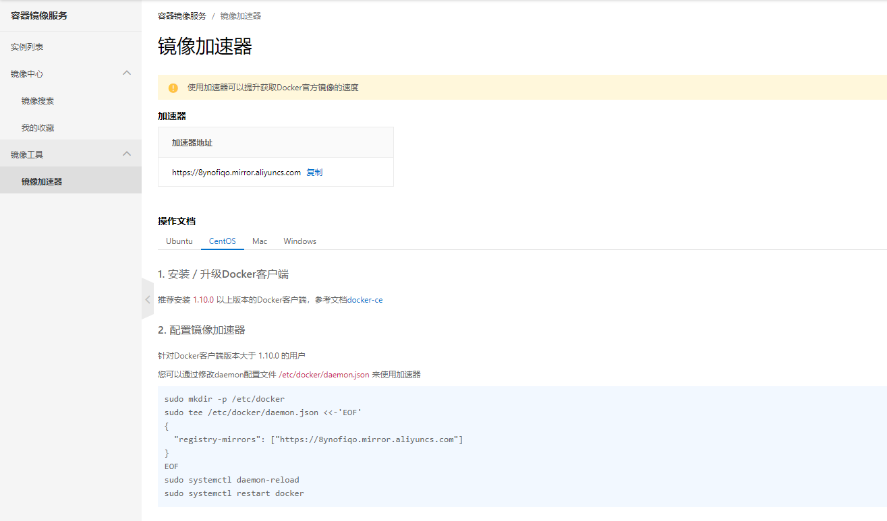

```
sudo mkdir -p /etc/docker

sudo tee /etc/docker/daemon.json <<-'EOF'
{
  "registry-mirrors": ["https://8ynofiqo.mirror.aliyuncs.com"]
}
EOF

sudo systemctl daemon-reload

sudo systemctl restart docker
```

## Run HelloWord流程

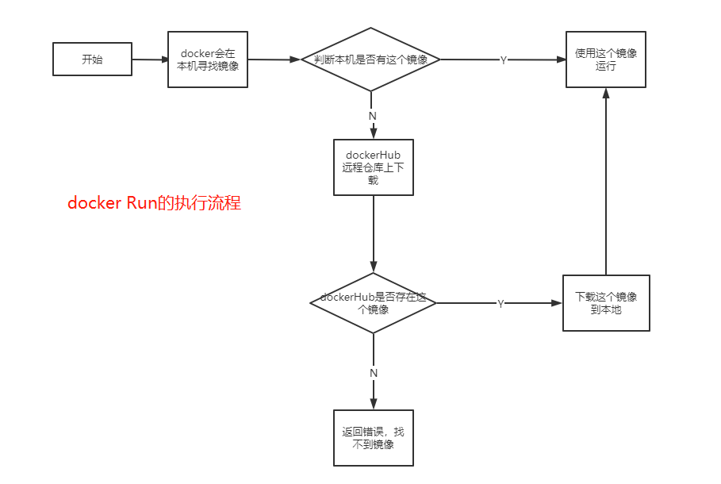

## 底层原理

**Docker是怎么工作的？**

Docker是一个Client-Server结构的系统，Docker的守护进程运行在主机上，通过socket从客户端访问。

DockerServer接收到Docker-Client的指令就会执行命令。

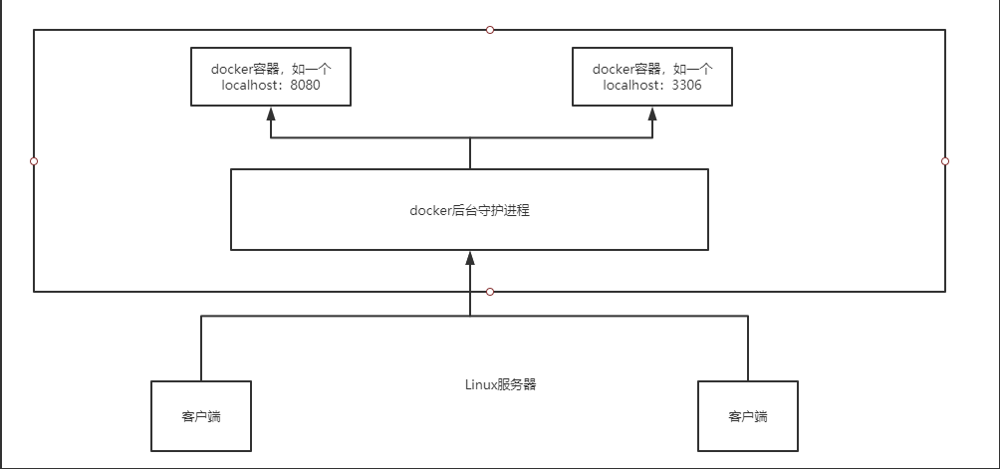

**Docker为什么比虚拟机快？**

1、Docker有着比虚拟机更少的抽象层

2、docker利用的是宿主机的内核，vm需要的是Guest OS

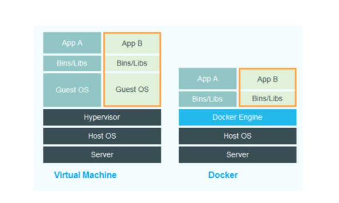

新建一个容器的时候，docker不需要向虚拟机重新加载一个操作系统内核，避免引导，虚拟机加载Guest OS 启动分钟级别，Docker是利用宿主机的操作系统，省略了复杂的过程，启动秒级别

# Docker的常用命令

https://docs.docker.com/reference/

```
docker --help # docker 的所有命令
```

## 镜像的命令

**docker images**

```
docker images	#列出最近下载的镜像

docker images java	#按名称列出镜像
docker images java:8	#按名称和标签列出镜像

docker images --no-trunc	#列出完整长度的镜像id

docker images --digests		#镜像列表摘要

docker images --filter "dangling=true" #过滤，显示未标记的镜像

docker images --format "{{.ID}}: {{.Repository}}" #格式化输出镜像列表

docker images --quiet #只显示镜像ID列表

```

**docker search**

```
docker search tomcat #搜索Tomcat镜像

--filter , -f		#过滤条件
--format			#格式化输出
--limit	25			#搜索最大结果输
--no-trunc			#不截断输出

docker search --filter=stars=3 --no-trunc tomcat  #搜索Tomcat镜像并且不截断输出 过滤start3颗星以下
```

**docker pull**

```
docker pull mysql #下载镜像，docker pull 镜像名称：tag
Using default tag: latest # 如果不指定tag版本号，则下载最新版本
latest: Pulling from library/mysql
69692152171a: Pull complete 	#分层下载，docker images的核心，联合文件系统
1651b0be3df3: Pull complete 
951da7386bc8: Pull complete 
0f86c95aa242: Pull complete 
37ba2d8bd4fe: Pull complete 
6d278bb05e94: Pull complete 
497efbd93a3e: Pull complete 
f7fddf10c2c2: Pull complete 
16415d159dfb: Pull complete 
0e530ffc6b73: Pull complete 
b0a4a1a77178: Pull complete 
cd90f92aa9ef: Pull complete 
Digest: sha256:d50098d7fcb25b1fcb24e2d3247cae3fc55815d64fec640dc395840f8fa80969	#签名
Status: Downloaded newer image for mysql:latest
docker.io/library/mysql:latest	#真实地址

#等价于
docker pull mysql
docker.io/library/mysql:latest

#指定版本镜像下载
docker pull mysql:5.7
```

**docker rmi**

```
docker rmi docker rmi -f  hello-world #删除镜像

--force , -f		#强制删除镜像
--no-prune			#不会删除没有标记的父镜像

docker rmi docker rmi -f  $(docker images -aq) #递归删除所有镜像了
```

## 容器命令

**有了镜像才可以创建容器，下载一个centos镜像来测试学习**

```
docker pull centos
```

**新建容器并启动**

```
docker run [可选参数] image

--name='Name'	#容器名字,区分容器
--d				#后台方式运行
--it			#使用交互方式运行，进入容器查看内容
-p				#指定容器的端口，-p 8080:8080
-P				#随机指定端口


###进行测试，启动容器

docker run -it centos  /bin/bash

```

**列出所有运行的容器**

```
docker  ps -a
```

**退出容器**

```
exit	#直接容器停止并退出
Ctrl+P+Q #容器不停止退出
```

**删除容器**

```
docker rm 容器id	#删除指定的容器，不能删除正在运行的容器，如果强制删除 rm -f
docker rm -f $(docker ps -aq)	#删除所有的容器
docker rm -a -q|xargs docker rm #删除所有的容器
```

**启动和停止容器的操作**

```
docker start 容器id
docker restart 容器id
docker stop 容器id
docker kill 容器id
```

## 其他常用命令

**查看日志**

```
docker logs -t -f --tail 容器id
```

**查看容器中进程信息**

```
docker top 容器id
```

**查看镜像的元数据**

```
docker inspect 容器id

[root@lucky /]# docker inspect 4dd6833d3610
[
    {
        "Id": "4dd6833d36109fc5ce92f450f76f239bff2430c0a061d613d4d0efe91f4c24b7",
        "Created": "2021-05-15T01:16:39.698803626Z",
        "Path": "/bin/sh",
        "Args": [
            "-c",
            "while true;do echo xiaoguang;sleep 1;done"
        ],
        "State": {
            "Status": "running",
            "Running": true,
            "Paused": false,
            "Restarting": false,
            "OOMKilled": false,
            "Dead": false,
            "Pid": 6084,
            "ExitCode": 0,
            "Error": "",
            "StartedAt": "2021-05-15T01:16:40.138516192Z",
            "FinishedAt": "0001-01-01T00:00:00Z"
        },
        "Image": "sha256:300e315adb2f96afe5f0b2780b87f28ae95231fe3bdd1e16b9ba606307728f55",
        "ResolvConfPath": "/var/lib/docker/containers/4dd6833d36109fc5ce92f450f76f239bff2430c0a061d613d4d0efe91f4c24b7/resolv.conf",
        "HostnamePath": "/var/lib/docker/containers/4dd6833d36109fc5ce92f450f76f239bff2430c0a061d613d4d0efe91f4c24b7/hostname",
        "HostsPath": "/var/lib/docker/containers/4dd6833d36109fc5ce92f450f76f239bff2430c0a061d613d4d0efe91f4c24b7/hosts",
        "LogPath": "/var/lib/docker/containers/4dd6833d36109fc5ce92f450f76f239bff2430c0a061d613d4d0efe91f4c24b7/4dd6833d36109fc5ce92f450f76f239bff2430c0a061d613d4d0efe91f4c24b7-json.log",
        "Name": "/pedantic_nobel",
        "RestartCount": 0,
        "Driver": "devicemapper",
        "Platform": "linux",
        "MountLabel": "",
        "ProcessLabel": "",
        "AppArmorProfile": "",
        "ExecIDs": null,
        "HostConfig": {
            "Binds": null,
            "ContainerIDFile": "",
            "LogConfig": {
                "Type": "json-file",
                "Config": {}
            },
            "NetworkMode": "default",
            "PortBindings": {},
            "RestartPolicy": {
                "Name": "no",
                "MaximumRetryCount": 0
            },
            "AutoRemove": false,
            "VolumeDriver": "",
            "VolumesFrom": null,
            "CapAdd": null,
            "CapDrop": null,
            "CgroupnsMode": "host",
            "Dns": [],
            "DnsOptions": [],
            "DnsSearch": [],
            "ExtraHosts": null,
            "GroupAdd": null,
            "IpcMode": "private",
            "Cgroup": "",
            "Links": null,
            "OomScoreAdj": 0,
            "PidMode": "",
            "Privileged": false,
            "PublishAllPorts": false,
            "ReadonlyRootfs": false,
            "SecurityOpt": null,
            "UTSMode": "",
            "UsernsMode": "",
            "ShmSize": 67108864,
            "Runtime": "runc",
            "ConsoleSize": [
                0,
                0
            ],
            "Isolation": "",
            "CpuShares": 0,
            "Memory": 0,
            "NanoCpus": 0,
            "CgroupParent": "",
            "BlkioWeight": 0,
            "BlkioWeightDevice": [],
            "BlkioDeviceReadBps": null,
            "BlkioDeviceWriteBps": null,
            "BlkioDeviceReadIOps": null,
            "BlkioDeviceWriteIOps": null,
            "CpuPeriod": 0,
            "CpuQuota": 0,
            "CpuRealtimePeriod": 0,
            "CpuRealtimeRuntime": 0,
            "CpusetCpus": "",
            "CpusetMems": "",
            "Devices": [],
            "DeviceCgroupRules": null,
            "DeviceRequests": null,
            "KernelMemory": 0,
            "KernelMemoryTCP": 0,
            "MemoryReservation": 0,
            "MemorySwap": 0,
            "MemorySwappiness": null,
            "OomKillDisable": false,
            "PidsLimit": null,
            "Ulimits": null,
            "CpuCount": 0,
            "CpuPercent": 0,
            "IOMaximumIOps": 0,
            "IOMaximumBandwidth": 0,
            "MaskedPaths": [
                "/proc/asound",
                "/proc/acpi",
                "/proc/kcore",
                "/proc/keys",
                "/proc/latency_stats",
                "/proc/timer_list",
                "/proc/timer_stats",
                "/proc/sched_debug",
                "/proc/scsi",
                "/sys/firmware"
            ],
            "ReadonlyPaths": [
                "/proc/bus",
                "/proc/fs",
                "/proc/irq",
                "/proc/sys",
                "/proc/sysrq-trigger"
            ]
        },
        "GraphDriver": {
            "Data": {
                "DeviceId": "31",
                "DeviceName": "docker-253:0-117441245-ddd2ee9d8716d4ac7e82d510b8f8b590f5a4c13133768589c321f4e431c423ec",
                "DeviceSize": "10737418240"
            },
            "Name": "devicemapper"
        },
        "Mounts": [],
        "Config": {
            "Hostname": "4dd6833d3610",
            "Domainname": "",
            "User": "",
            "AttachStdin": false,
            "AttachStdout": false,
            "AttachStderr": false,
            "Tty": false,
            "OpenStdin": false,
            "StdinOnce": false,
            "Env": [
                "PATH=/usr/local/sbin:/usr/local/bin:/usr/sbin:/usr/bin:/sbin:/bin"
            ],
            "Cmd": [
                "/bin/sh",
                "-c",
                "while true;do echo xiaoguang;sleep 1;done"
            ],
            "Image": "centos",
            "Volumes": null,
            "WorkingDir": "",
            "Entrypoint": null,
            "OnBuild": null,
            "Labels": {
                "org.label-schema.build-date": "20201204",
                "org.label-schema.license": "GPLv2",
                "org.label-schema.name": "CentOS Base Image",
                "org.label-schema.schema-version": "1.0",
                "org.label-schema.vendor": "CentOS"
            }
        },
        "NetworkSettings": {
            "Bridge": "",
            "SandboxID": "684d496bdaf73dd0ef6140dc5eaa8767654f330a3ff972f563b5f58cfed80ad0",
            "HairpinMode": false,
            "LinkLocalIPv6Address": "",
            "LinkLocalIPv6PrefixLen": 0,
            "Ports": {},
            "SandboxKey": "/var/run/docker/netns/684d496bdaf7",
            "SecondaryIPAddresses": null,
            "SecondaryIPv6Addresses": null,
            "EndpointID": "2b3598ce581902f215794848abccc8abdef185bd21ddf3bbafced2c06ea27dd0",
            "Gateway": "172.17.0.1",
            "GlobalIPv6Address": "",
            "GlobalIPv6PrefixLen": 0,
            "IPAddress": "172.17.0.2",
            "IPPrefixLen": 16,
            "IPv6Gateway": "",
            "MacAddress": "02:42:ac:11:00:02",
            "Networks": {
                "bridge": {
                    "IPAMConfig": null,
                    "Links": null,
                    "Aliases": null,
                    "NetworkID": "b12c2feb5a9e98821338ce9b8ee18d90832b461c1ed3d44a37b083b93d648f06",
                    "EndpointID": "2b3598ce581902f215794848abccc8abdef185bd21ddf3bbafced2c06ea27dd0",
                    "Gateway": "172.17.0.1",
                    "IPAddress": "172.17.0.2",
                    "IPPrefixLen": 16,
                    "IPv6Gateway": "",
                    "GlobalIPv6Address": "",
                    "GlobalIPv6PrefixLen": 0,
                    "MacAddress": "02:42:ac:11:00:02",
                    "DriverOpts": null
                }
            }
        }
    }
]
```

**进入当前运行的容器**

```
##通常容器使用后台方式运行的，如果需要进入容器修改一些配置等
##进入容器开启一个新的终端
docker exec -it 容器id /bin/bash
##进入容器正在执行的终端，不会启动新的进程
docker attach  容器id
```

**从容器内拷贝文件到主机上**

```
docker cp 容器id：容器内路径  目的主机的路径 


[root@lucky home]# docker attach a6abcb693fc9	##进入docker容器
[root@a6abcb693fc9 /]# ls
bin  dev  etc  home  lib  lib64  lost+found  media  mnt  opt  proc  root  run  sbin  srv  sys  tmp  usr  var
[root@a6abcb693fc9 /]# cd home/
[root@a6abcb693fc9 home]# ls 
[root@a6abcb693fc9 home]# 
[root@a6abcb693fc9 home]# touch test.java		##创建测试文件
[root@a6abcb693fc9 home]# ls
test.java
[root@lucky home]# docker cp a6abcb693fc9:/home/test.java /home ##copy容器内的文件到主机
[root@lucky home]# ls
ceshiCP_dockerfile.java  lucky  test.java

```

## 作业练习

>Docker 安装一个nginx

```
# 1.搜索镜像 search
# 2.下载镜像 pull
# 3.运行测试

[root@lucky home]# docker images ##查看下载的镜像
REPOSITORY   TAG       IMAGE ID       CREATED        SIZE
nginx        latest    f0b8a9a54136   2 days ago     133MB
centos       latest    300e315adb2f   5 months ago   209MB
[root@lucky home]# docker run -d --name=nginx001 -p 3344:80 f0b8a9a54136   ##启动nginx，名称，映射的端口号
3ae3a580a9f02da7f1bba63848e1b6220079f4efd079f285f0b79413baac2615
[root@lucky home]# curl localhost:3344 ##测试访问
<!DOCTYPE html>
<html>
<head>
<title>Welcome to nginx!</title>
<style>
    body {
        width: 35em;
        margin: 0 auto;
        font-family: Tahoma, Verdana, Arial, sans-serif;
    }
</style>
</head>
<body>
<h1>Welcome to nginx!</h1>
<p>If you see this page, the nginx web server is successfully installed and
working. Further configuration is required.</p>

<p>For online documentation and support please refer to
<a href="http://nginx.org/">nginx.org</a>.<br/>
Commercial support is available at
<a href="http://nginx.com/">nginx.com</a>.</p>

<p><em>Thank you for using nginx.</em></p>
</body>
</html>

```

**端口暴露的概念**

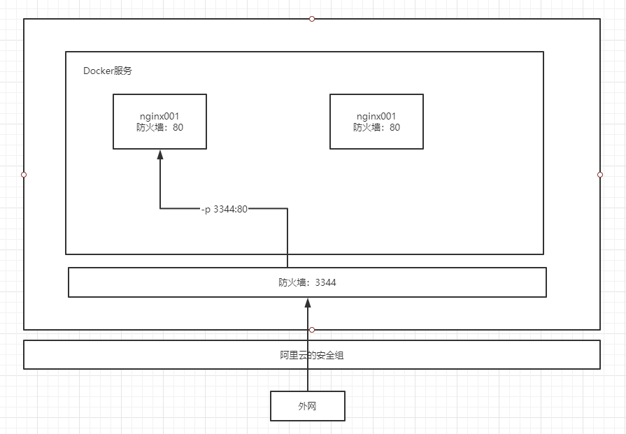

>Docker 安装Tomcat

```
##官方的使用
docker run -it --rm tomcat:9.0

##我们之前使用的是都是启动后台，停止了容器之后，容器历史还是可以查到，docker run -it --rm ，一般用来测试，用完即删除

##下载再启动
docker pull tomcat

##启动运行
docker run -d -p 3355:8080 --name=tomcat001 tomcat

##测试运行 404

##进入容器 
docker exec -it tomcat001 /bin/bash

##发现问题，1.Linux命令少了，2.没有webapps，阿里云镜像的原因，默认是最小的镜像阉割版，
##保证最小的运行环境
```

思考：以后部署项目，每次进入容器修改文件十分麻烦

>Docker 安装es，kibana

````
## es 暴露的端口很多
## 十分的耗内存
## es的数据需要挂载到安全目录，挂载

docker run -d --name elasticsearch --net somenetwork -p 9200:9200 -p 9300:9300 -e "discovery.type=single-node" elasticsearch:tag

## --net somenetwork ？ 网络配置
##  -e "discovery.type=single-node" ？集群设置，单个节点

##启动elasticsearch成功，但十分卡，怎么解决：赶紧关闭，增加对内存的限制
[root@lucky home]# curl localhost:9200
{
  "name" : "4cnPDm1",
  "cluster_name" : "elasticsearch",
  "cluster_uuid" : "jKVCK6PWShaUCAMINKNXew",
  "version" : {
    "number" : "5.6.12",
    "build_hash" : "cfe3d9f",
    "build_date" : "2018-09-10T20:12:43.732Z",
    "build_snapshot" : false,
    "lucene_version" : "6.6.1"
  },
  "tagline" : "You Know, for Search"
}

## docker stats 查看CPU的状态
##es是十分耗内存的
````

```
##  增加对内存的限制 	-e  修改环境配置文件

docker run -d --name elasticsearch  -p 9200:9200 -p 9300:9300 -e "discovery.type=single-node" -e ES_JAVA_OPTS="-Xms64m -Xmx512m" elasticsearch002

[root@lucky home]# docker stats
CONTAINER ID   NAME               CPU %     MEM USAGE / LIMIT     MEM %     NET I/O     BLOCK I/O       PIDS
38fa9f15913d   elasticsearch002   0.01%     266.8MiB / 3.682GiB   7.07%     586B / 0B   67MB / 30.7kB   43

```

思考：使用Kibana连接es，网络如何才能连接过去

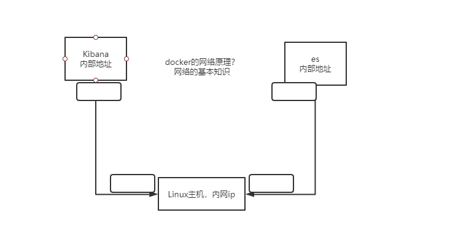

## 可视化

- portainer(先用这个)
- Rancher(持续集成再用)

**什么是portainer**

Docker图形化界面管理工具，提供一个后台面板供我们操作

```
docker run -d -p 8088:9000  --restart=always -v /var/run/docker.sock:/var/run/docker.sock --name prtainer-test docker.io/portainer/portainer
```

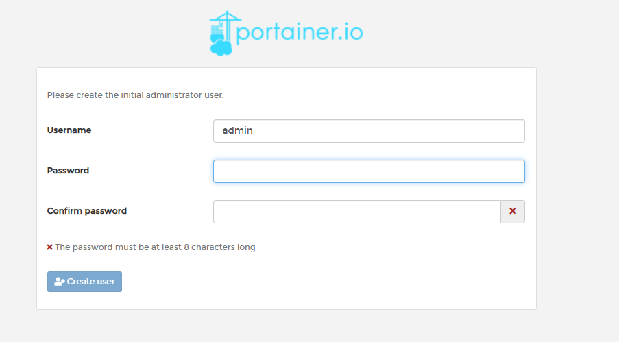

# commit 镜像

```
docker commit 提交容器一个新的副本
##命令和git原理类似
docker commot -m"描述信息" -a="作者" 容器id  目标镜像名：[tag]
```

实战测试

```
#1.启动一个默认的tomcat

#2.发现这个默认的tomcat没有webapps，镜像的原因，官方的镜像默认webapps下没有文件

#3.我自己进去拷贝了文件

#4.将我们操作过的容器通过commit提交为一个镜像，以后就可以用修改过的镜像启动容器
```

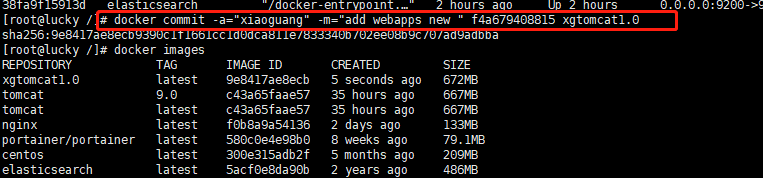

# 容器数据卷

## 什么是容器数据卷

**docker的理念回顾**

将应用环境打包成一个镜像~

数据怎么办？如果数据都在容器中，容器被删除，数据就会丢失 ！==**需求：数据可以持久化** ==

MySQL，容器删除，删库跑路；**==MySQL数据可以存储在本地==**

容器之间可以有一个数据共享的技术，Docker容器中产生的数据，可以同步到本地

卷技术！！！就是目录的挂载，将我们容器中的目录挂载到Linux上。

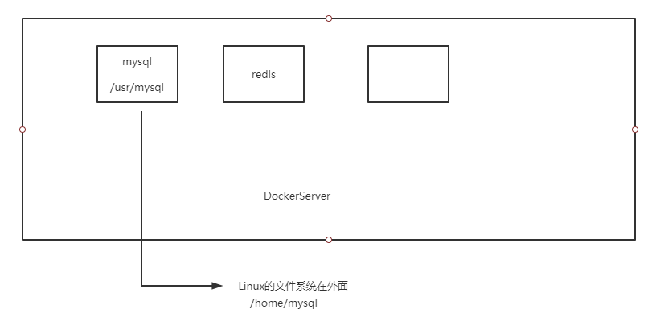

**总结：容器的持久化和同步操作，容器间也是可以数据共享的~~~**

## 使用数据卷

>方式一：使用命令实现挂载 -v

```
docker run -it -v 主机目录：容器内目录  镜像

##测试
docker run -it -v /home/ceshi:/home centos /bin/bash

##查看元数据 
docker inspect 挂载的容器id
```

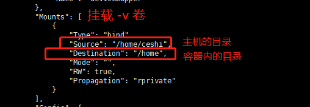


测试文件的同步

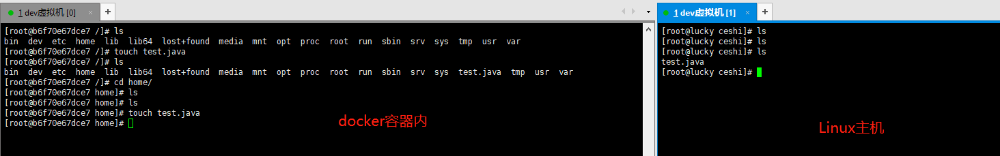

测试Linux主机同步内容到容器

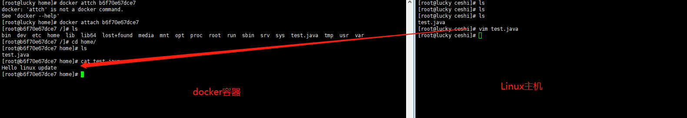

## 作业练习

>安装MySQL
>
>思考：MySQL的数据持久化问题

```
## 下载镜像
docker pull mysql:5.7
## 启动容器，进行数据卷挂载，安装启动mysql，需要配置登录密码
## 官方测试：docker run --name some-mysql -e MYSQL_ROOT_PASSWORD=my-secret-pw -d mysql:tag

##自己执行测试
# -d 后台运行
# -p 映射端口
# -v 数据挂载
# -e 环境配置
# --name 容器名字
[root@lucky home]# docker run -d -p 3310:3306 -v /home/mysql/conf:/etc/mysql/conf.d -v /home/mysql/data:/var/lib/mysql -e MYSQL_ROOT_PASSWORD=123456 --name=mysql001 mysql:5.7

```

测试连接

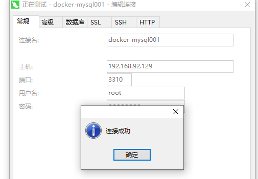

假设我们将容器删除，挂载到本地的数据卷依旧被丢失，实现数据持久化

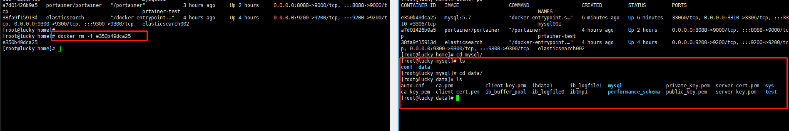

## 具名挂载和匿名挂载

```
#匿名挂载
 -v 容器内路径
 docker run -d -P --name=nginx01 -v /etc/nginx nginx
 
#查看所有的volume的情况
[root@lucky home]# docker volume ls
DRIVER    VOLUME NAME
local     8c1dae8970fac2c76a371a901d9d61522b0e2a65bc9cdbdb4e9fb06fc219c954
local     175f1d767b048e22849f297d3075a1b5c0a4691d3f4fc49800ef1b4b05da241b
local     b92661392c9fb19b26668c3c16ddaa569e05e6decb0c583722a752d739617d9d
local     f65fa3732cc82e5b853b1b812d9f7fb5a19b872109a4adb5efca1c17a1074bbb
##这种就是匿名挂载， -v 只写了容器内的路径，没有写容器外的路径

## 具名挂载
docker run -d -P --name=nginx02 -v juming-nginx:/etc/nginx nginx
#查看所有的volume的情况
[root@lucky home]# docker volume ls
DRIVER    VOLUME NAME
local     8c1dae8970fac2c76a371a901d9d61522b0e2a65bc9cdbdb4e9fb06fc219c954
local     175f1d767b048e22849f297d3075a1b5c0a4691d3f4fc49800ef1b4b05da241b
local     b92661392c9fb19b26668c3c16ddaa569e05e6decb0c583722a752d739617d9d
local     f65fa3732cc82e5b853b1b812d9f7fb5a19b872109a4adb5efca1c17a1074bbb
local     juming-nginx

## -v 卷名：容器内路径
## 查看一下这个卷的inspect
[root@lucky home]# docker volume inspect juming-nginx
[
    {
        "CreatedAt": "2021-05-15T15:40:01+08:00",
        "Driver": "local",
        "Labels": null,
        "Mountpoint": "/var/lib/docker/volumes/juming-nginx/_data",
        "Name": "juming-nginx",
        "Options": null,
        "Scope": "local"
    }
]
```

所有的docker容器内的卷，没有指定目录的情况下都是在  /var/lib/docker/volume/xxx/_data

通过具名挂载可以方便找到我们挂载的一个卷，大多数情况在具名挂载

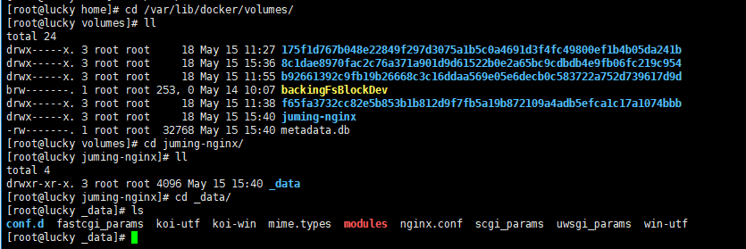

```
### 如何确定具名挂载，匿名挂载，还是指定路径挂载
-v 容器内路径	#匿名挂载
-v 卷名：容器内路径	#具名挂载
-v /宿主机路径：容器内路径	#指定路径挂载
```

其他写法

```
## 通过 -v 容器内路径:ro/rw 改变读写权限

ro readonly #只读
rw readwrite #可读可写

##一旦设置了容器权限，容器就怼挂载出来的内容进行了限定
docker run -d -P --name=nginx02 -v juming-nginx:/etc/nginx:ro nginx
docker run -d -P --name=nginx02 -v juming-nginx:/etc/nginx:rw nginx

#ro 只要看到了ro说明这个路径只能通过宿主机来操作，容器内部无法操作
```

## 初识DockerFile

dockerFile 就是用来构建docker镜像的构建文件，命令脚本！

通过这个脚本可以生成镜像，镜像是一层一层的，脚本是一个一个的命令，每个命令都是一层

```
##创建一个dockerfile文件
##文件中指令内容都是大写的
[root@lucky docker-test-volume]# vim dockerfiletest1 

FORM centos
VOLUME ["volume1","volume2"]
CMD echo "---end---"
CMD /bin/bash
```

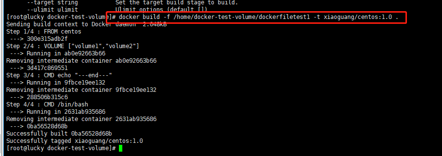

启动自己构建的镜像


这个卷和外部一定有一个同步的目录


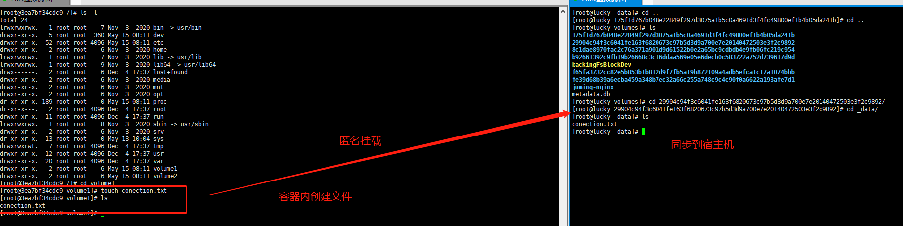

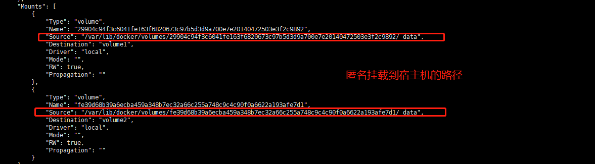

以后这种方式情况很多哦~~

假设构建镜像时候没有挂载卷，要手动镜像挂载  -v 卷名:容器内路径

## 数据卷容器

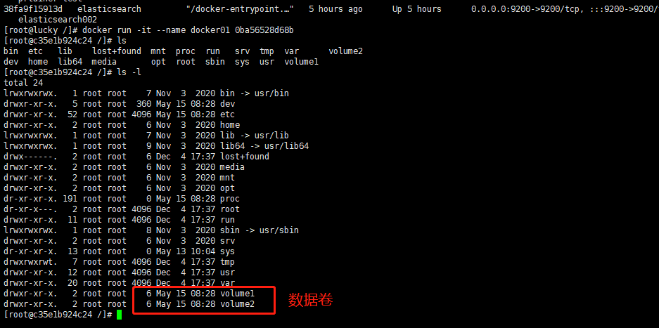

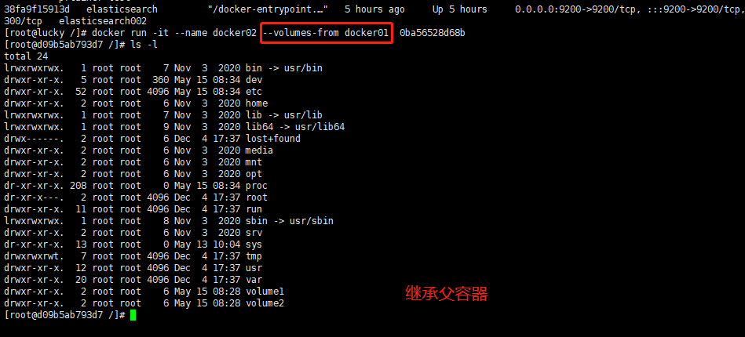

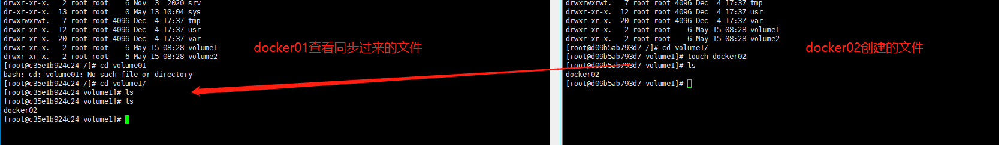

```
##测试，可以删除docker01，查看一下docker02和docker03是否还可以访问这个文件
##测试依旧可以访问
```

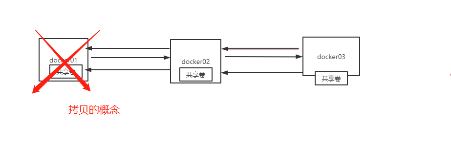

多个mysql之间实现数据共享

```
[root@lucky home]# docker run -d -p 3310:3306 -v /etc/mysql/conf.d -v /var/lib/mysql -e MYSQL_ROOT_PASSWORD=123456 --name=mysql001 mysql:5.7
dde4647994d785c14cf9a602f5f63a896b28089169633372f73ca3d9b4509908
[root@lucky home]# docker run -d -p 3311:3306  -e MYSQL_ROOT_PASSWORD=123456 --volumes-from mysql001  --name=mysql002 mysql:5.7
de8061607197f6237d04e3fb4cf8804858806db752e2aa7aabcbdd59e4bcff8c
```


# DockerFile

## DockerFile介绍

dockerfile就是用来构建docker镜像的文件，命令参数脚本

构建步骤

1. 编写一个dockerFIle脚本文件
2. docker build 构建成一个镜像
3. docker run 运行镜像
4. docker push 发布镜像（DockerHub,阿里云镜像仓库）

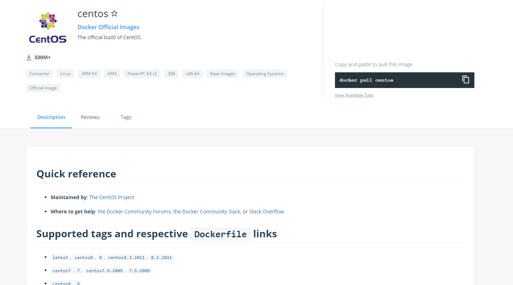

查看一下官方怎么干

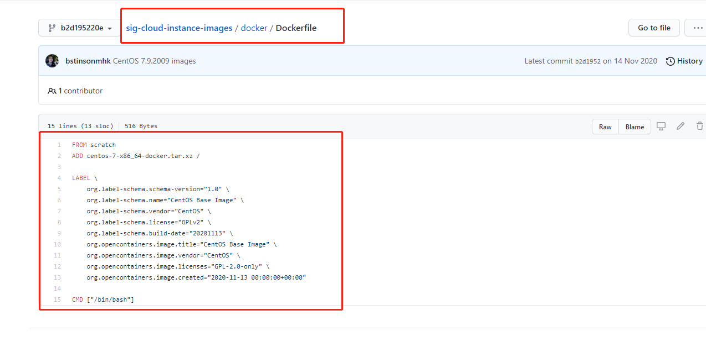

## DockerFile构建

很多指令

**基础知识**

1. 每个保留关键字（指令）都必须是大写字母
2. 执行从上到下顺序执行
3. #表示注释
4. 每一个指令都会创建一个新的镜像层，并提交

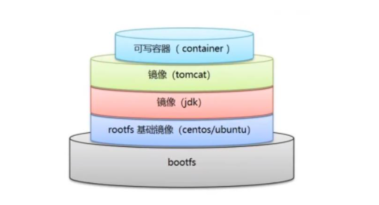

dockerFile是面向开发的，以后发布项目的时候，作镜像就需要编写dockerFile文件

Docker镜像逐渐成为企业交付的标准

DockerFile：构建文件，定义了一切步骤，源代码

DockerImages：通过DockerFile构建生成的镜像，最终发布和运行的产品

Docker容器：容器就是镜像运行起来提供服务的

## DockerFile的指令

```
FROM			#基础镜像，一切从这里开始构建
MAINTAINER		#镜像是谁写的，姓名+邮箱
RUN				#镜像构建的时候需要运行的命令
ADD				#步骤：tomcat镜像，这个tomcat压缩包，添加内容
WORKDIR			#镜像的工作目录
VOLUME			#挂载的目录
EXPOSE			#暴露端口配置
CMD				#指定这个容器启动的时候要运行的命令，只有最后一个会生效，可被替代
ENTRYPOINT		#指定这个容器启动的时候要运行的命令，可以追加命令
ONBUILD			#当构建一个被继承DockerFile 这个时候就会运行 OBBUILD的指令，触发指令
COPY			#类似ADD，将我们文件拷贝到镜像中
ENV				#构建的时候设置环境变量
```


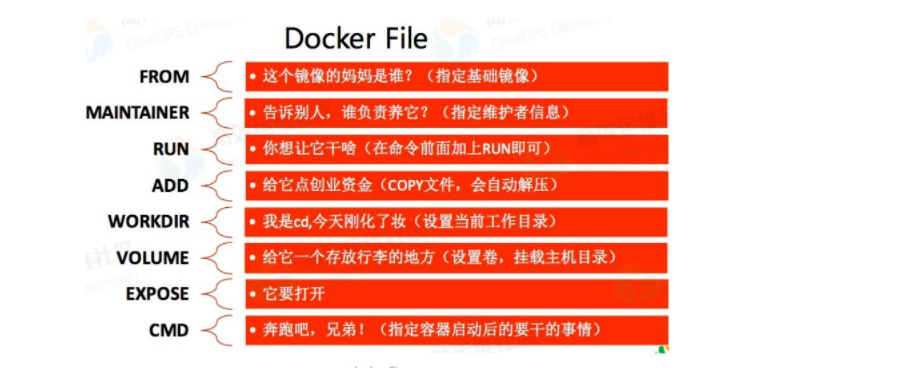

> 创建一个自己的centos

```
## 1. 编写DockerFile的文件
[root@lucky dockerfile]# cat mydockerFile-centos 
FROM centos
MAINTAINER xiaoguang<1024@163.com>

ENV MYPATH /usr/local
WORKDIR $MYPATH


RUN yum -y install vim
RUN yum -y install net-tools

EXPOSE 80

CMD echo $MYPATH
CMD echo "---end-------"
CMD /bin/bash
[root@lucky dockerfile]# 

## 2.通过build命令 构建镜像
docker build -f mydockerFile-centos -t mycentos .

Successfully built 956790abf45b
Successfully tagged mycentos:latest
## 3.测试运行	
```

**docker history 容器id，查看镜像的构建历史**


>CMD和ENTRYPOINT的区别

```shell
CMD				#指定这个容器启动的时候要运行的命令，只有最后一个会生效，可被替代
ENTRYPOINT		#指定这个容器启动的时候要运行的命令，可以追加命令
```

测试 CMD

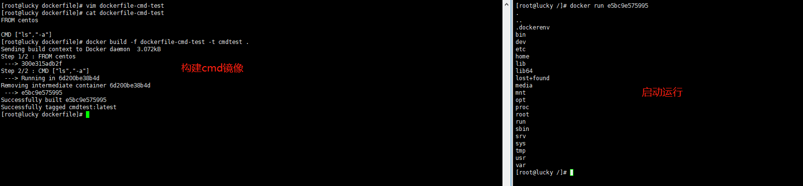

```shell
## 想追加一个命令 -l ls -al
[root@lucky /]# docker run e5bc9e575995 -l
docker: Error response from daemon: OCI runtime create failed: container_linux.go:367: starting container process caused: exec: "-l": executable file not found in $PATH: unknown.
ERRO[0000] error waiting for container: context canceled 
## cmd镜像清理一下 -l 替换了CMD ["ls","-a"]命令，-l不是命令，所以报错
```

测试ENTRYPOINT

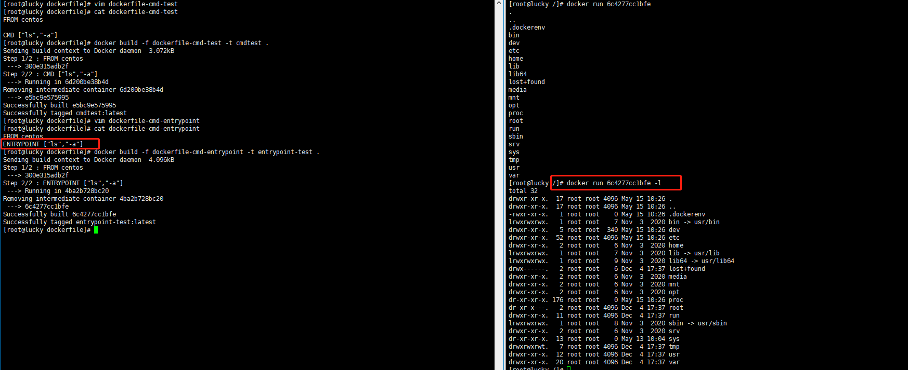

docker命令最好的学习就是对比测试结果

## 练习：Tomcat镜像

1、准备镜像文件，jdk1.8,tomcat 

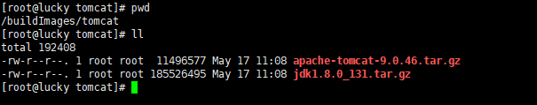

2、编写DockerFile文件,官方命名 **Dockerfile** build会自动寻找这个文件，就不需要-f指定

```
### DockerFile 内容

FROM centos
MAINTAINER xiaoguang<1024@163.com>

COPY readme.txt /usr/local/readme.txt

ADD jdk1.8.0_131.tar.gz /usr/local/
ADD apache-tomcat-9.0.46.tar.gz /usr/local/

RUN yum -y install vim

ENV MYPATH /usr/local
WORKDIR $MYPATH

ENV JAVA_HOME /usr/local/jdk1.8.0_131
ENV CLASSPATH $JAVA_HOME/lib/dt.jar:$JAVA_HOME/lib/tools.jar
ENV CATALINA_HOME /usr/local/apache-tomcat-9.0.46
ENV CATALINA_BASH /usr/local/apache-tomcat-9.0.46

ENV PATH $PATH:$JAVA_HOME/bin:$CATALINA_HOME/lib:$CATALINA_HOME/bin

EXPOSE 8080

CMD /usr/local/apache-tomcat-9.0.46/bin/startup.sh && tail -F /usr/local/apache-tomcat-9.0.46/bin/logs/catalina.out

```

3、构建镜像

```shell
docker build -t diytomcat .
```

4、启动镜像

```shell
docker run -d -p 9090:8080 --name=xgdiytomcat -v /buildImages/tomcat/test:/usr/local/apache-tomcat-9.0.46/webapps/test -v /buildImages/tomcat/tomcatlogs:/usr/local/apache-tomcat-9.0.46/logs diytomcat
```

5、访问测试

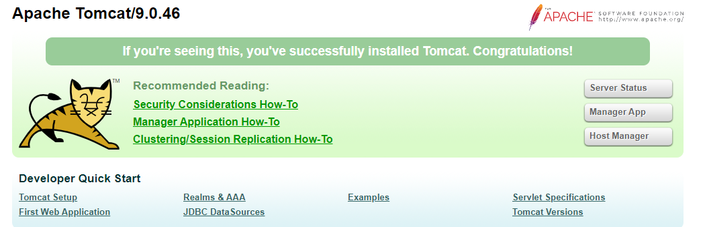

6、发布镜像（由于做了卷挂载，我们直接在本地编写项目就可发布）

在本地添加一个界面，进行测试访问

```shell
<?xml version="1.0" encoding="UTF-8"?>
<web-app xmlns:xsi="http://www.w3.org/2001/XMLSchema-instance" xmlns="http://java.sun.com/xml/ns/javaee" xmlns:web="http://java.sun.com/xml/ns/javaee/web-app_2_5.xsd" xsi:schemaLocation="http://java.sun.com/xml/ns/javaee http://java.sun.com/xml/ns/javaee/web-app_2_5.xsd" id="WebApp_ID" version="2.5">
  <welcome-file-list>
    <welcome-file>index.html</welcome-file>
    <welcome-file>index.htm</welcome-file>
    <welcome-file>index.jsp</welcome-file>
    <welcome-file>default.html</welcome-file>
    <welcome-file>default.htm</welcome-file>
    <welcome-file>default.jsp</welcome-file>
  </welcome-file-list>
</web-app>
```

```shell
<%@ page language="java" contentType="text/html; charset=UTF-8"
    pageEncoding="UTF-8"%>
<!DOCTYPE html>
<html>
<head>
<meta charset="utf-8">
<title>Hello MyDiy Docker Images</title>
</head>
<body>
Hello World!<br/>
 <h2>Hello MyDiy Docker Images</h2>    
<%
 System.out.println("------my diy tomcat images");
%>
</body>
</html>
```

## 发布自己的镜像

> DockerHub

1、www.hub.docker.com 注册自己的账号

2、在该网站并且可以登录


3、服务器上提交自己的镜像

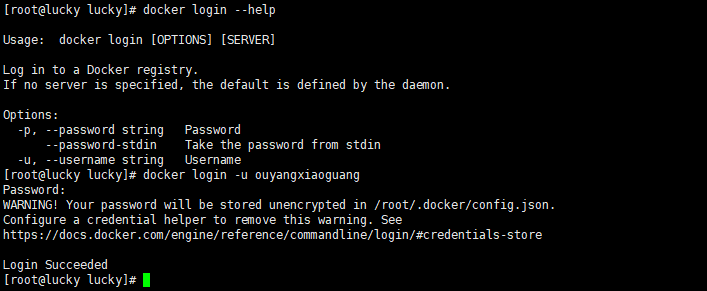

4、登录完毕，docker push 镜像

```shell

### push镜像的问题
[root@lucky lucky]# docker push ouyangxiaoguang/diytomcat:1.0
The push refers to repository [docker.io/ouyangxiaoguang/diytomcat]
An image does not exist locally with the tag: ouyangxiaoguang/diytomcat

### 解决 增加一个tag
[root@lucky lucky]# docker tag 81200ec60af4 xiaoguang/diytomcat:1.0

### push
[root@lucky lucky]# docker push xiaoguang/diytomcat:1.0
The push refers to repository [docker.io/xiaoguang/diytomcat]
46c29143676e: Preparing 
3856fad23a2f: Preparing 
13504f11e379: Preparing 
a24b74fbc08e: Preparing 
2653d992f4ef: Preparing 
denied: requested access to the resource is denie ##拒绝

```

> 发布阿里云镜像仓库

1、登录阿里云中心

2、找到容器镜像服务


3、创建命名空间

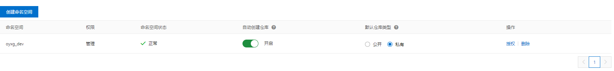

4、创建镜像仓库

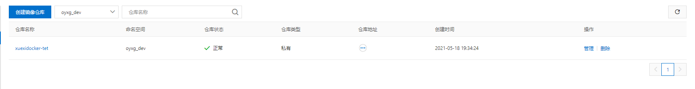

5、浏览基本信息

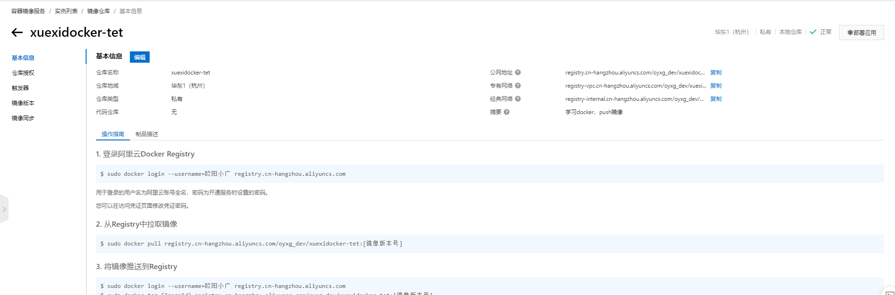


6、发布阿里云

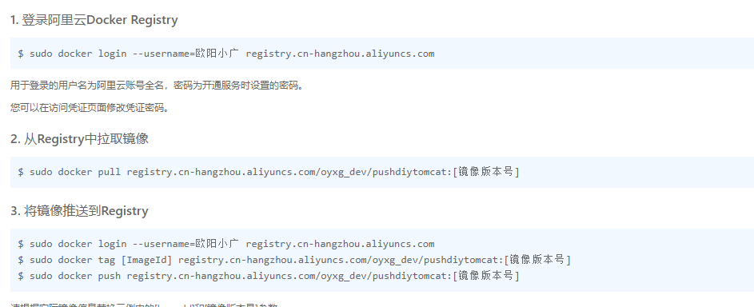

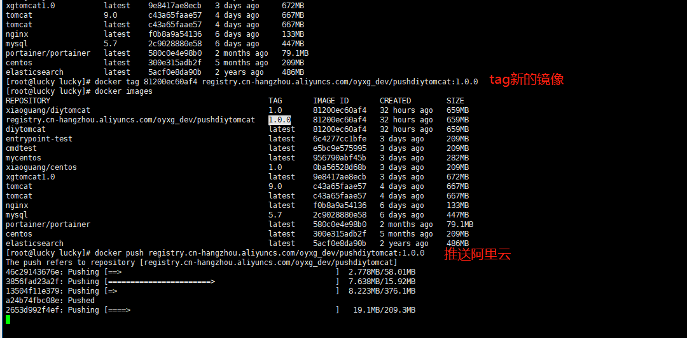

## 小结

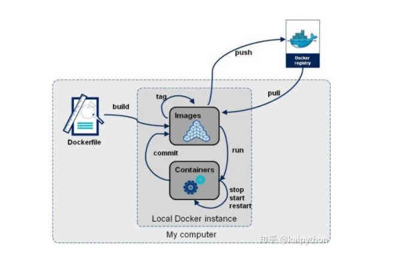

# Docker网络

## 理解Docker0

清空所有镜像和容器

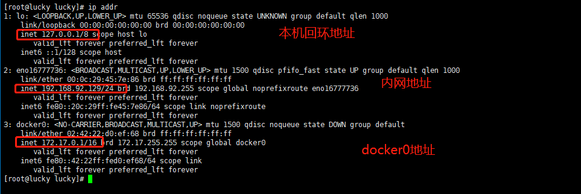

三个网络

```shell
### 问题：docker是如何处理容器网络访问的？
```


```shell


###查看容器的内部网络地址  ip addr  发现容器启动的时候会得到 eth0@if7 IP地址 docker分配的
[root@lucky ~]# docker exec -it  tomcat01 ip addr
1: lo: <LOOPBACK,UP,LOWER_UP> mtu 65536 qdisc noqueue state UNKNOWN group default qlen 1000
    link/loopback 00:00:00:00:00:00 brd 00:00:00:00:00:00
    inet 127.0.0.1/8 scope host lo
       valid_lft forever preferred_lft forever
6: eth0@if7: <BROADCAST,MULTICAST,UP,LOWER_UP> mtu 1500 qdisc noqueue state UP group default 
    link/ether 02:42:ac:11:00:02 brd ff:ff:ff:ff:ff:ff link-netnsid 0
    inet 172.17.0.2/16 brd 172.17.255.255 scope global eth0
       valid_lft forever preferred_lft forever

##Linux 能不能ping通容器内部
[root@lucky ~]# ping 172.17.0.2
PING 172.17.0.2 (172.17.0.2) 56(84) bytes of data.
64 bytes from 172.17.0.2: icmp_seq=1 ttl=64 time=0.106 ms
64 bytes from 172.17.0.2: icmp_seq=2 ttl=64 time=0.090 ms

### Linux 可以ping通容器内部
```

>原理

1、我们每启动一个docker容器，docker就会给docker分配一个IP，我们只要安装了docker，就会有一个docker0桥接模式，使用的技术是evth-pair技术


2、在启动一个容器测试，发现又多了一对网卡 


```shell
### 我们发现这个容器带来网卡，都是一对一对的
### evth-pair 就是一对虚拟的设备接口，他们都是成对出现的，一段连着协议，一段彼此相连
### 正因为有这个特性，evth-pair充当一个桥梁，连接各种虚拟网络设备
### OpenStac,Docker 容器之间的联系 ，ovs的连接，都是使用evth-pair技术
```

3、测试Tomcat01 ping Tomcat02是否可以ping通

```shell
[root@lucky ~]# docker exec -it tomcat02 ping 172.17.0.2
PING 172.17.0.2 (172.17.0.2) 56(84) bytes of data.
64 bytes from 172.17.0.2: icmp_seq=1 ttl=64 time=0.118 ms
64 bytes from 172.17.0.2: icmp_seq=2 ttl=64 time=0.065 ms
64 bytes from 172.17.0.2: icmp_seq=3 ttl=64 time=0.109 ms
```

网络模型图


结论：Tomcat01和Tomcat02是公用的一个路由器，docker0，所有的容器不指定网络的情况下，都是docker0路由的，docker会给我们的容器分配一个默认的IP

>小结

docker使用的是Linux的桥接，宿主机中是一个docker0容器的网桥；


docker中所有的网络接口都是虚拟的，虚拟的转发效率高（内网传递文件）

只要容器删除，对应的网桥一对就没了！！！

## --link

> 思考一个场景，编写一个微服务，database url =ip,项目不重启，数据库IP换掉了，处理这个问题可以使用名字来访问容器。

```shell
[root@lucky ~]# docker exec -it tomcat01 ping tomcat02
ping: tomcat02: Name or service not known

#如何可以解决呢？
#通过--link既可以解决了网络连通问题
[root@lucky ~]# docker run -d -P --name=tomcat03 --link tomcat02 tomcat
411a376dd42f796ab195ba0cb493ac6a1c17f027024c1ced40f00de2f23dd9fa
[root@lucky ~]# docker exec -it tomcat03 ping tomcat02
PING tomcat02 (172.17.0.3) 56(84) bytes of data.
64 bytes from tomcat02 (172.17.0.3): icmp_seq=1 ttl=64 time=0.133 ms
64 bytes from tomcat02 (172.17.0.3): icmp_seq=2 ttl=64 time=0.064 ms
64 bytes from tomcat02 (172.17.0.3): icmp_seq=3 ttl=64 time=0.064 ms
64 bytes from tomcat02 (172.17.0.3): icmp_seq=4 ttl=64 time=0.059 ms

##可以反向ping通吗？
[root@lucky ~]# docker exec -it tomcat02 ping tomcat03
ping: tomcat03: Name or service not known
```

其实Tomcat03就是在本地配置了Tomcat02的配置

```shell
[root@lucky ~]# docker exec -it tomcat03 cat /etc/hosts
127.0.0.1	localhost
::1	localhost ip6-localhost ip6-loopback
fe00::0	ip6-localnet
ff00::0	ip6-mcastprefix
ff02::1	ip6-allnodes
ff02::2	ip6-allrouters
172.17.0.3	tomcat02 60e3804625ab
172.17.0.4	411a376dd42f
```

本质探究：--link就是我们在hosts配置中增加了一个172.17.0.3	tomcat02 60e3804625ab

工作使用docker不建议使用--link！！！

自定义网络，不适用于docker0

docker0问题：他不支持容器名连接访问

## 自定义网络

> 查看所有的docker网络


网络模式

bridge：桥接docker默认，自己创建也使用bridge

none：不配置网络

host：和宿主机共享网络

container：容器网络连通，（用的少，局限很大）

**测试**

```shell
##我们直接启动命令， --net bridge，而这个就是我们的docker0
docker run -d -P --name=tomcat01  tomcat
docker run -d -P --name=tomcat01 --net bridge tomcat

##docker0的特点，默认，域名不能访问，--link可以打通连接

##我们可以自定义网络
##--driver bridge
##--subnet 192.168.0.0/16
##--gateway 192.168.0.1
[root@lucky ~]# docker network create --driver bridge  --subnet 192.168.0.0/16 --gateway 192.168.0.1 mynet
b06fcc7b4cec5f6dce66db51035927018b439f4f2e2f2549c89e1668669c78fe
[root@lucky ~]# docker network ls
NETWORK ID     NAME      DRIVER    SCOPE
88b167a9aefb   bridge    bridge    local
7ddbf3bd5092   host      host      local
b06fcc7b4cec   mynet     bridge    local
c652647c294e   none      null      local
```


```shell
###创建指定自定义网络Tomcat
[root@lucky ~]# docker run -d -P --name=tomcat-net-01 --net mynet tomcat
[root@lucky ~]# docker run -d -P --name=tomcat-net-02 --net mynet tomcat

## inspect mynet
[root@lucky ~]# docker network inspect mynet
[
    {
        "Name": "mynet",
        "Id": "b06fcc7b4cec5f6dce66db51035927018b439f4f2e2f2549c89e1668669c78fe",
        "Created": "2021-03-30T08:00:36.455680562+08:00",
        "Scope": "local",
        "Driver": "bridge",
        "EnableIPv6": false,
        "IPAM": {
            "Driver": "default",
            "Options": {},
            "Config": [
                {
                    "Subnet": "192.168.0.0/16",
                    "Gateway": "192.168.0.1"
                }
            ]
        },
        "Internal": false,
        "Attachable": false,
        "Ingress": false,
        "ConfigFrom": {
            "Network": ""
        },
        "ConfigOnly": false,
        "Containers": {
            "510c26b11fe50bb6f479c4b12d417afdf1b228f0ae29c754e5be5ec2415ff815": {
                "Name": "tomcat-net-02",
                "EndpointID": "2d79d74d58b48234dd93c4a80cef574aa922762dbf63e2bd17afa5e67561ce24",
                "MacAddress": "02:42:c0:a8:00:03",
                "IPv4Address": "192.168.0.3/16",
                "IPv6Address": ""
            },
            "bba9c827ebeb4c31ccc8519fb4326176ab4fe8df03bc1b6f27bb5b1c59901e1f": {
                "Name": "tomcat-net-01",
                "EndpointID": "e0a02255e7448ddca8ec2387c8fa5daa9acbb05ec801a6879a2be115ed06d0ea",
                "MacAddress": "02:42:c0:a8:00:02",
                "IPv4Address": "192.168.0.2/16",
                "IPv6Address": ""
            }
        },
        "Options": {},
        "Labels": {}
    }
]

##再次测试ping连接
[root@lucky ~]# docker exec -it tomcat-net-01 ping 192.168.0.3
PING 192.168.0.3 (192.168.0.3) 56(84) bytes of data.
64 bytes from 192.168.0.3: icmp_seq=1 ttl=64 time=0.132 ms
##不用--link
[root@lucky ~]# docker exec -it tomcat-net-02 ping tomcat-net-01
PING tomcat-net-01 (192.168.0.2) 56(84) bytes of data.
64 bytes from tomcat-net-01.mynet (192.168.0.2): icmp_seq=1 ttl=64 time=0.049 ms
```


## 网络连通


```shell
##测试打通 Tomcat01连接mynet
 [root@lucky ~]# docker network connect mynet tomcat0
## 连通之后就是将Tomcat01放到了mynet网络下？

#一个容器两个IP
```


```shell
[root@lucky ~]# docker exec -it tomcat01 ping tomcat-net-01
PING tomcat-net-01 (192.168.0.2) 56(84) bytes of data.
64 bytes from tomcat-net-01.mynet (192.168.0.2): icmp_seq=1 ttl=64 time=0.084 ms
64 bytes from tomcat-net-01.mynet (192.168.0.2): icmp_seq=2 ttl=64 time=0.108 ms
```

## 部署Redis集群


```shell
## 创建自定义网卡
[root@lucky ~]# docker network create redis  --subnet 172.38.0.0/16


##通过脚本创建6个Redis配置
for port in $(seq 1 6);\
do \
mkdir -p /mydata/redis/node-${port}/conf
touch /mydata/redis/node-${port}/conf/redis.conf
cat << EOF >/mydata/redis/node-${port}/conf/redis.conf
port 6379
bind 0.0.0.0
cluster-enabled yes
cluster-config-file nodes.conf
cluster-node-timeout 5000
cluster-announce-ip 172.38.0.1${port}
cluster-announce-port 6379
cluster-announce-bus-port 16379
appendonly yes
EOF
done

docker run -p 637${port}:6379 -p 1637${port}:16379 --name redis-${port}\
-v /mydata/redis/node-${port}/data:/data \
-v /mydata/redis/node-${port}/conf/redis.conf:/etc/redis/redis.conf \
-d --net redis -ip 172.38.0.1${port} redis:5.0.9-alpine3.11 redis-server /etc/redis/redis.conf

docker run -p 6371:6379 -p 16371:16379 --name redis-1 \
-v/mydata/redis/node-1/data:/data \
-v /mydata/redis/node-1/conf/redis.conf:/etc/redis/redis.conf \
-d --net redis  redis:5.0.9-alpine3.11 redis-server /etc/redis/redis.conf
 
docker run -p 6372:6379 -p 16372:16379 --name redis-2 \
-v/mydata/redis/node-2/data:/data \
-v /mydata/redis/node-2/conf/redis.conf:/etc/redis/redis.conf \
-d --net redis  redis:5.0.9-alpine3.11 redis-server /etc/redis/redis.conf

docker run -p 6373:6379 -p 16373:16379 --name redis-3 \
-v/mydata/redis/node-3/data:/data \
-v /mydata/redis/node-3/conf/redis.conf:/etc/redis/redis.conf \
-d --net redis  redis:5.0.9-alpine3.11 redis-server /etc/redis/redis.conf

docker run -p 6374:6379 -p 16374:16379 --name redis-4 \
-v/mydata/redis/node-4/data:/data \
-v /mydata/redis/node-4/conf/redis.conf:/etc/redis/redis.conf \
-d --net redis  redis:5.0.9-alpine3.11 redis-server /etc/redis/redis.conf

docker run -p 6375:6379 -p 16375:16379 --name redis-5 \
-v/mydata/redis/node-5/data:/data \
-v /mydata/redis/node-5/conf/redis.conf:/etc/redis/redis.conf \
-d --net redis  redis:5.0.9-alpine3.11 redis-server /etc/redis/redis.conf

docker run -p 6376:6379 -p 16376:16379 --name redis-6 \
-v/mydata/redis/node-6/data:/data \
-v /mydata/redis/node-6/conf/redis.conf:/etc/redis/redis.conf \
-d --net redis  redis:5.0.9-alpine3.11 redis-server /etc/redis/redis.conf


##创建集群，进入redis容器中
/data # redis-cli --cluster create 172.38.0.2:6379  172.38.0.3:6379 172.38.0.4:6379 172.38.0.5:6379 172.38.0.6:6379 172.38.0.7:6379  --cluster-replicas 1

>>> Performing hash slots allocation on 6 nodes...
Master[0] -> Slots 0 - 5460
Master[1] -> Slots 5461 - 10922
Master[2] -> Slots 10923 - 16383
Adding replica 172.38.0.6:6379 to 172.38.0.2:6379
Adding replica 172.38.0.7:6379 to 172.38.0.3:6379
Adding replica 172.38.0.5:6379 to 172.38.0.4:6379
M: 243852ff9f6f445afa9a55f5158de0c33957f676 172.38.0.2:6379
   slots:[0-5460] (5461 slots) master
M: 3e38ed7ee38df118d5d26fd366d3975301f1d861 172.38.0.3:6379
   slots:[5461-10922] (5462 slots) master
M: cc91a0362773458285f9198dc3d727875e1fac9e 172.38.0.4:6379
   slots:[10923-16383] (5461 slots) master
S: cdf9c05a4c69f108dc952d9a8701b5116f320f21 172.38.0.5:6379
   replicates cc91a0362773458285f9198dc3d727875e1fac9e
S: b5e0f264b73465aa3f6510674dbd46aca57b6960 172.38.0.6:6379
   replicates 243852ff9f6f445afa9a55f5158de0c33957f676
S: 83d06e3059bde56f706f0c99b2ed0f41a48dec79 172.38.0.7:6379
   replicates 3e38ed7ee38df118d5d26fd366d3975301f1d861
Can I set the above configuration? (type 'yes' to accept): yes
>>> Nodes configuration updated
>>> Assign a different config epoch to each node
>>> Sending CLUSTER MEET messages to join the cluster
Waiting for the cluster to join
...
>>> Performing Cluster Check (using node 172.38.0.2:6379)
M: 243852ff9f6f445afa9a55f5158de0c33957f676 172.38.0.2:6379
   slots:[0-5460] (5461 slots) master
   1 additional replica(s)
S: b5e0f264b73465aa3f6510674dbd46aca57b6960 172.38.0.6:6379
   slots: (0 slots) slave
   replicates 243852ff9f6f445afa9a55f5158de0c33957f676
S: 83d06e3059bde56f706f0c99b2ed0f41a48dec79 172.38.0.7:6379
   slots: (0 slots) slave
   replicates 3e38ed7ee38df118d5d26fd366d3975301f1d861
S: cdf9c05a4c69f108dc952d9a8701b5116f320f21 172.38.0.5:6379
   slots: (0 slots) slave
   replicates cc91a0362773458285f9198dc3d727875e1fac9e
M: cc91a0362773458285f9198dc3d727875e1fac9e 172.38.0.4:6379
   slots:[10923-16383] (5461 slots) master
   1 additional replica(s)
M: 3e38ed7ee38df118d5d26fd366d3975301f1d861 172.38.0.3:6379
   slots:[5461-10922] (5462 slots) master
   1 additional replica(s)
[OK] All nodes agree about slots configuration.
>>> Check for open slots...
>>> Check slots coverage...
[OK] All 16384 slots covered.


###集群成功
127.0.0.1:6379> cluster info
cluster_state:ok
cluster_slots_assigned:16384
cluster_slots_ok:16384
cluster_slots_pfail:0
cluster_slots_fail:0
cluster_known_nodes:6
cluster_size:3
cluster_current_epoch:6
cluster_my_epoch:1
cluster_stats_messages_ping_sent:82
cluster_stats_messages_pong_sent:89
cluster_stats_messages_sent:171
cluster_stats_messages_ping_received:84
cluster_stats_messages_pong_received:82
cluster_stats_messages_meet_received:5
cluster_stats_messages_received:171
```

## springboot项目打包docker镜像

1、构建springboot项目

2、打包应用

3、编写dockerfile

4、构建镜像

5、发布运行

# Docker Compose

## 简介

Docker

Dockerfile build run 手动操作，单个容器！

微服务，100个服务，依赖关系。

Docker Compose来轻松高效的管理容器，定义运行多个容器。

> 三步骤

1、Dockerfile保证我们的项目在任何地方可以运行

2、docker-compose.yml怎么写

3、docker-compose up启动项目

>理解

Compose 是Docker官方的开源 项目，需要安装
