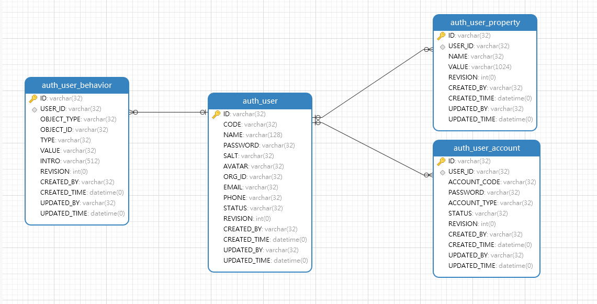
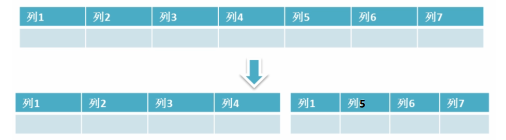

# 关于WMS日常开发工作的编码约束

> 表设计时的约束，每个字段都要有注释~~~

1、主键索引字段 column：id；table的主键值，值的形式推荐使用雪花算法生成，要么就用Hutool的唯一ID工具-IdUtil，公共维护表数据少主键可以使用递增生成

2、编号字段column：xxx_no 

3、编码字段 column：xxx_code，编码名称字段 column：xxx_name；设计表时，如果有国家，省市区等字段，需要与前端人员协商传值问题；例：湖南省，web界面需要回显中文，后端编写业务流程时通过拿编码进行处理相对方便，表设计时可以code-name的形式进行存储值，界面展示name,后端拿code走流程

4、表与表之间的外键关联，推荐辅表的外键字段关联主表主键（id），也可附带加上冗余字段编号字段，名称字段等，下面是例图



5、后端开发人员在进行表设计之初请与产品人员确认使用场景，进行垂直拆分表，将一张列比较多的表拆分成多张表



```shell
## 把不常用的字段单独放在一张表;

## 把text，blob等大字段拆分出来放在附表中;

## 经常组合查询的列放在一张表中;
```

> Java开发注意